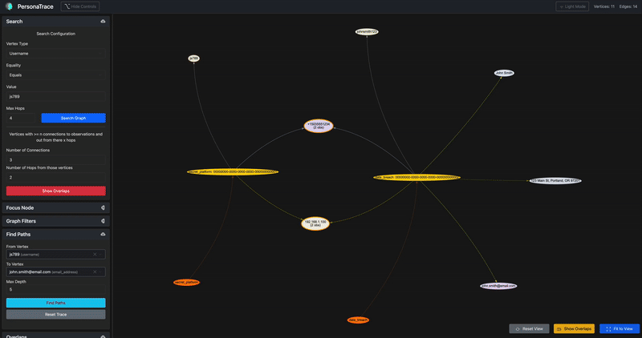

# PersonaTrace

PersonaTrace is a graph-based identity correlation and visualization tool that helps analyze relationships between identity attributes across multiple data sources ranging from publicly available information to personal datasets.

## But Why?

With a wide range of scenarios from threat intel and law enforcement to privacy research, the intent is to take various online interactions that have email addresses, usernames, IP addresses, phone numbers, etc and tie them together to find correlations. 

Imagine this scenario. You have an account on a "secret platform" and think you did a good job of obscuring your identity. But, leaks happen...

```text
"Secret platform" exposed:      Username + IP address
Leak 2 exposed:                 Username + IP address + Email
Leak 3 exposed:                                         Email, Name, and Phone Number
```

Now, with relative confidence, we can tie your "secret platform" persona to your email address, name, and phone number.

## Demo



## Components Setup - In Order

### Neo4j

You can setup a local test Neo4j instance as described in [neo4j-setup/README.md](neo4j-setup/README.md). This provides a local graph database for testing and development.

### Data Loader

Script to load example identity observation data into Neo4j that will be visualized in the PersonaTrace app. The data loader processes structured JSON files containing identity observations and creates nodes and relationships in the graph database. See [dataloader/README.md](dataloader/README.md) for detailed documentation.

### PersonaTrace App

The web application for visualizing and analyzing identity correlations. This provides an interactive graph interface where you can explore relationships between identity attributes, search for specific patterns, and identify overlaps between different data sources. See [app/README.md](app/README.md) for detailed documentation.

#### Key Features

- Interactive graph visualization of identity attributes and relationships
- Search and filtering capabilities
- Overlap detection between identity observations
- Configurable graph display options
- Support for Neo4j graph database
